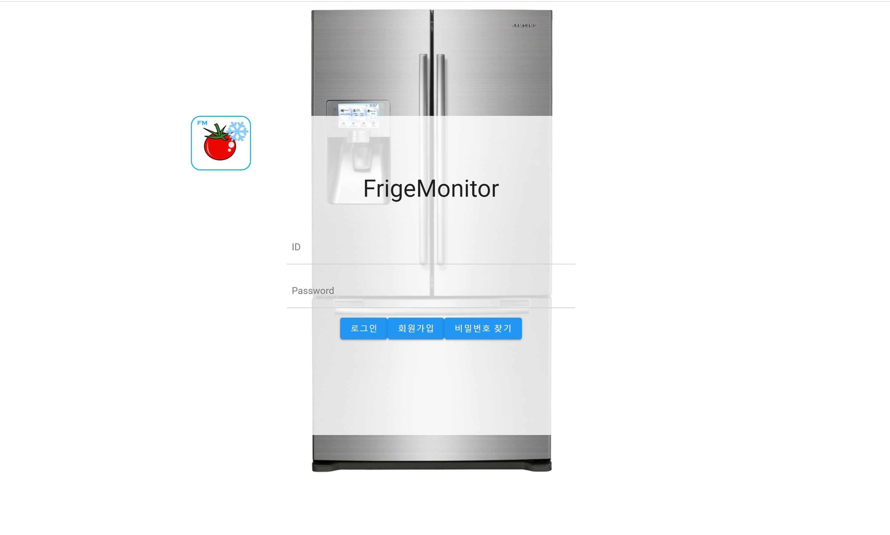
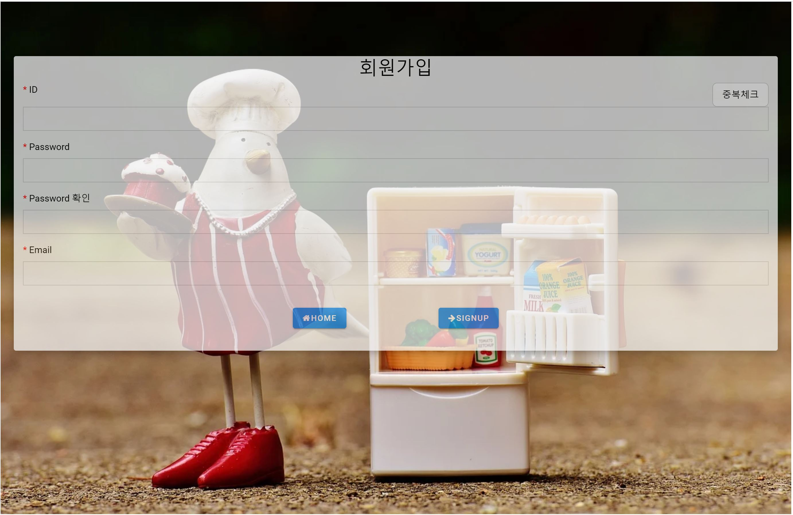
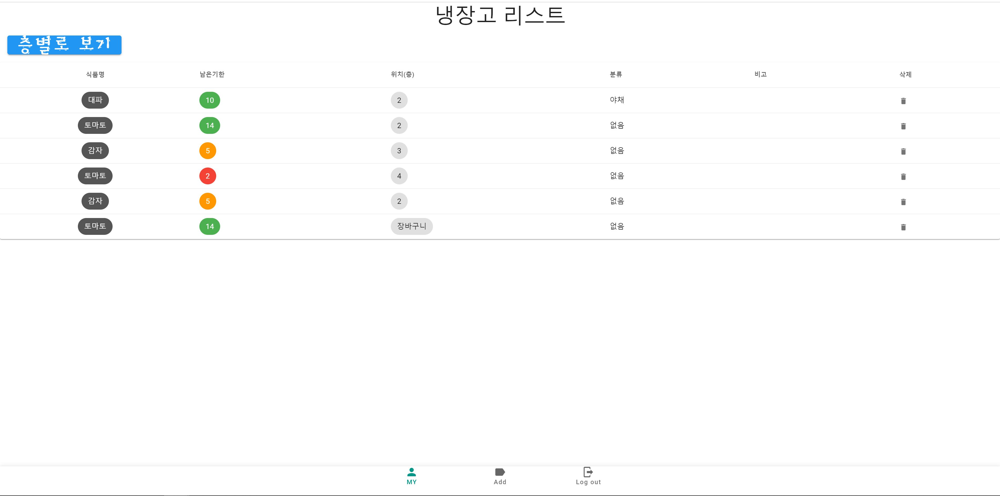
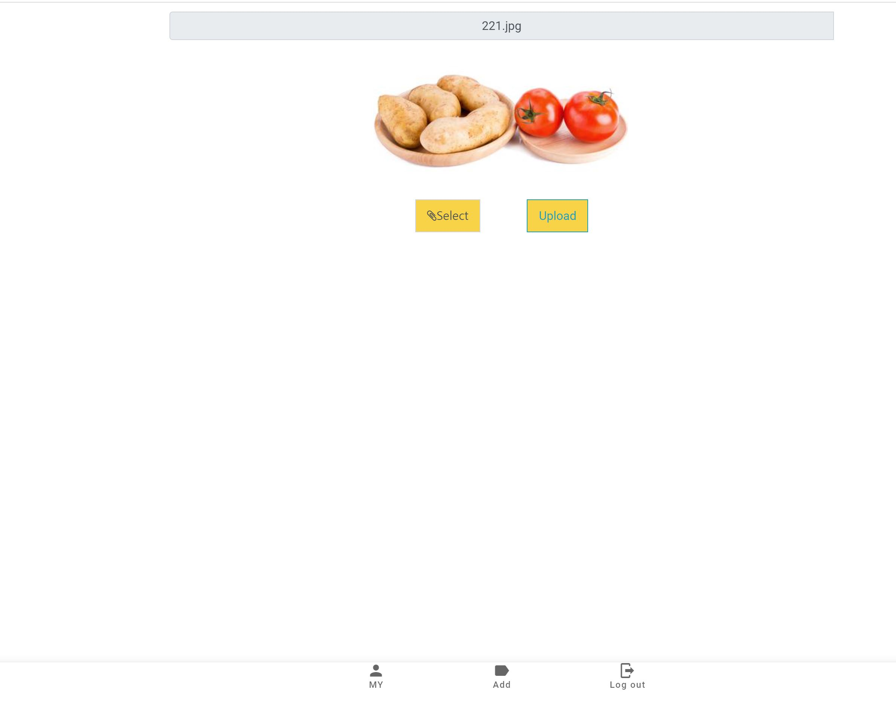
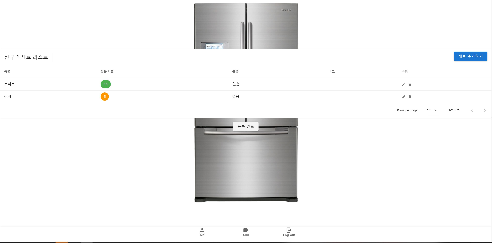
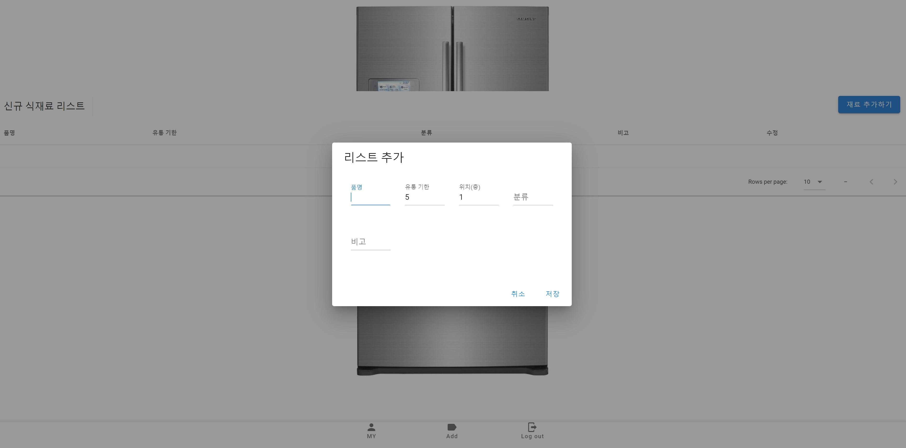
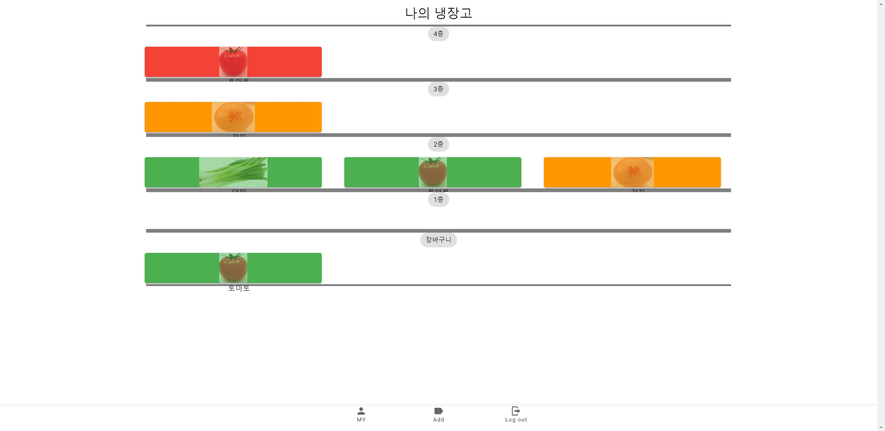
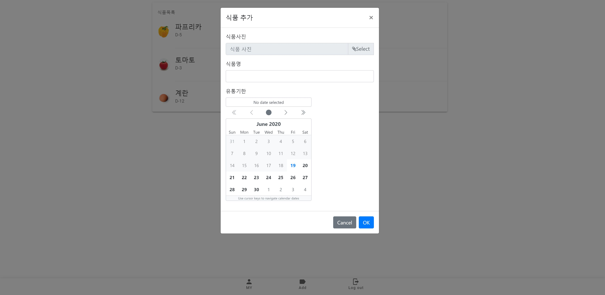

# Fridge Monitor

## 냉장고 유통기한 관리 서비스

장보고 온 품목들에 대하여 사진을 찍어 등록하고, 각 품목에 대한 유통기한 관리를 할 수 있습니다.

## 1. Frontend - Vue.js

### 1-1. 개발환경 구성

Node.js 설치

https://nodejs.org/ko/download/

Vue.js 설치

https://kr.vuejs.org/v2/guide/installation.html


### 1-2 컴포넌트 설치

```
npm install
```


### 1-3 서버 실행

```
npm run serve
```


## 2. Backend - Anaconda

### 2-1 개발환경 구성

아나콘다 설치

https://www.anaconda.com/download/

### 2-2 가상환경 구성

```
conda create -n AI
```

### 2-3 가상환경 실행

```
conda activate AI
```


## 3. Backend - Django

### 3-1 개발환경 구성

https://tutorial.djangogirls.org/ko/django_installation/

### 3-2 필요 pip 설치

아나콘다 가상환경이 실행된 상태에서 ./web/backend/ 에서

```
pip install -r requirement.txt
```

필요 패키지들이 설치된다.

## 3-3 DB 설치

```
python manage.py makemigrations
python manage.py migrate
```

설치되었는지 확인

 ```
python manage.py showmigrations
 ```


## 4. 식재료 학습파일 생성

### 4-1 식재료 정보 크롤링

./AI/car_training/crawl.py에서 자동차 정보를 json파일로 저장한다.

네이버 자동차의 각페이지에 있는 정보를 저장


### 4-2. 모델 학습

./AI/car_training/Learning_cars.py 에서 이미지들을이용하여 학습을 시작한다.

학습 모델은 Inception V3를 사용했다.


### 4-3 예측 파일 적용

Django의 views.py에서

```python
from media.AI import Image_Searcher 
```

모델 추정이 필요할때 

해당 경로의 Image_Searcher.py안의 detector함수를 불러와서 결과를 받아온다.


## 5. 서비스 페이지

### 5-1. 로그인 페이지



접속하면 가장 처음에 뜨는 페이지,

로그인을 해야 사용 가능 (개인별 냉장고 관리)


### 5-2. 회원가입 페이지



회원가입 페이지


### 5-3. 메인 페이지



로그인을 하면 가장 처음 나타나는 페이지,

자신의 냉장고에 있는 전체 품목을 볼 수 있다.

층별로 보기를 클릭하면 각 층별로 어떤 물품이 있는지 나타나는 페이지로 이동

각 품목을 클릭하면 각 품목의 정보가 나타나는 페이지로 이동


### 5-4. 예측 결과 및 저장 페이지



1. 냉장고에 넣을 식재료들의 사진을 업로드,


2. 이미지를 통해 Object Detection이 진행되는 동안 나타나는 로딩 페이지



3. 인식된 재료들이 리스트로 나타난다.

   

4. 그 외 인식되지 않은 재료들은 '재료 추가하기' 버튼을 통해 등록한 후

5. 등록 완료 버튼으로 등록 시킨다.


### 5-4. 품목 정리 페이지



냉장고 내의 품목이 층별로 나타난다.

드래그&드랍을 통해 냉장고 층의 이동이 가능하다.


### 5-5. 품목 추가 



이미지 인식 기능을 통하지 않고 직접 제품을 등록해줄 수 있도록 하는 페이지

